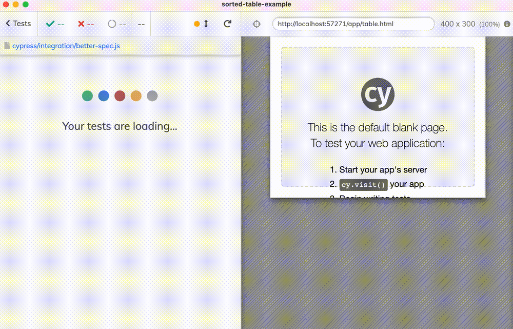

# sorted-table-example    [![renovate-app badge][renovate-badge]][renovate-app]

> Cypress testing if the table is sorted by a column

Read the blog post [Functional Helpers For Cypress Tests](https://glebbahmutov.com/blog/fp-cy-helpers/) and check out [spec.js](./cypress/integration/spec.js) and [better-spec.js](./cypress/integration/better-spec.js) test files.

Read the blog post [Spy On DOM Methods And Properties](https://glebbahmutov.com/blog/spy-on-dom-methods/) and check out [spy-on-removeAttribute.js](./cypress/integration/spy-on-removeAttribute.js) and [spy-on-innerHTML.js](./cypress/integration/spy-on-innerHTML.js) test files.

Read the blog post [Check Items For Duplicates](https://glebbahmutov.com/blog/check-for-duplicates/) and check out [duplicates-spec.js](./cypress/integration/duplicates-spec.js) tests.

## Videos

- [Add Unit Tests To Verify chai-sorted Assertion Plugin](https://youtu.be/skjPl8wvHEo)
- [Debug Ramda Pipeline in Cypress Test](https://youtu.be/jlBNdJPscJk)

## Small print

Author: Gleb Bahmutov &lt;gleb.bahmutov@gmail.com&gt; &copy; 2021

- [@bahmutov](https://twitter.com/bahmutov)
- [glebbahmutov.com](https://glebbahmutov.com)
- [blog](https://glebbahmutov.com/blog)
- [videos](https://www.youtube.com/glebbahmutov)
- [presentations](https://slides.com/bahmutov)
- [cypress.tips](https://cypress.tips)

License: MIT - do anything with the code, but don't blame me if it does not work.

[renovate-badge]: https://img.shields.io/badge/renovate-app-blue.svg
[renovate-app]: https://renovateapp.com/
